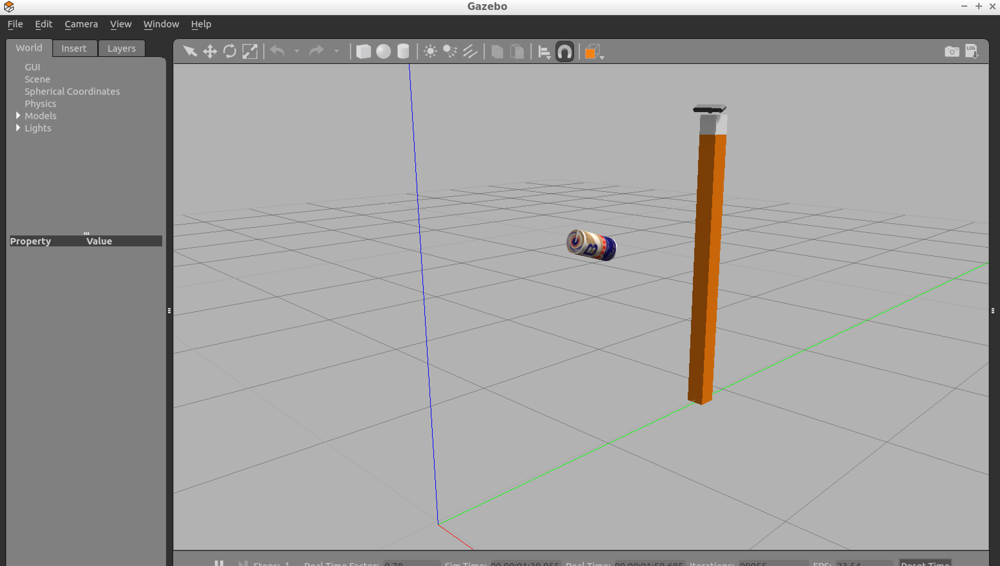
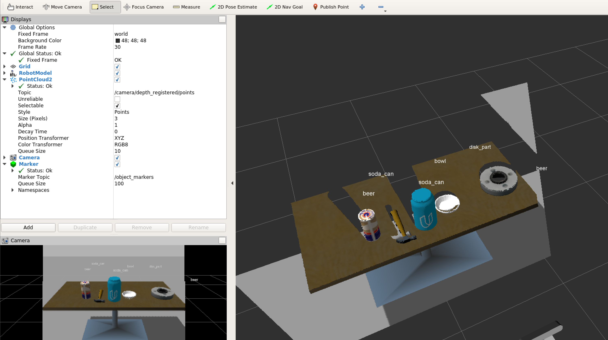

# ROS 3D Object Recognition in RGB-D point cloud

This project performs 3D object recognition on data obtained from a RGB-D camera. It utilizes 3D segmentation from [3D Segmentation](../3D_Segmentation) project.

## Feature extraction
First, object features need to be extracted and linear SVM trained to recognize objects.

Features that are used for recognizing 3D objects are the following:
* histogram of HSV channels of pictures of objects
* histogram of normals of surfaces of objects

These two features are combined into a single feature vector and passed to linear SVM for training.

---
To start training, open a terminal in your Catkin workspace and type the following first:

***catkin_make***

***source devel/setup.bash***

***roslaunch sensor_stick training.launch***

Then open a new terminal in the workspace and start the training:

***rosrun sensor_stick capture_features.py***

This produces a feature file ***training_set.sav*** in your Catkin workspace directory named.

Here is what you see in Gazebo:

During feature extraction, each object is randomly rotated/placed 50 times and its feature vectors are captured.

# Training
Next, linear SVM has to be trained from these features.

Assuming you installed ***scikit-learn***, you can start training by typing the following in your workspace:

***rosrun sensor_stick train_svm.py***

With this setup the resulting accuracy is around 70%. To improve accuracy, more training runs as well as different histogram bins should be considered.

Result of training is stored in the file ***model.sav***. Copy this file to ***src/sensor_stick/scripts*** directory.

---
## Real-time 3D Object Recognition

Now is time to perform real-time 3D object detection. 

In your Catkin workspace run the following in first terminal:

***roslaunch sensor_stick robot_spawn.launch***

Then type the following in another terminal in your Catkin workspace:
 
***cd src/sensor_stick/scripts***
***./object_recognition.py***

In RViz you'll see the following real-time:

You can see classification labels over various 3D objects. You are now able to recognize 3D objects real-time to a large extent.

