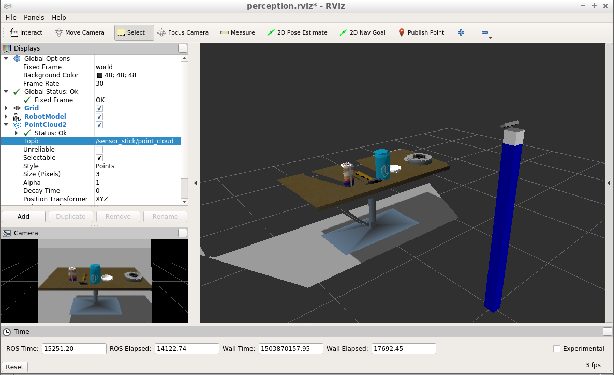
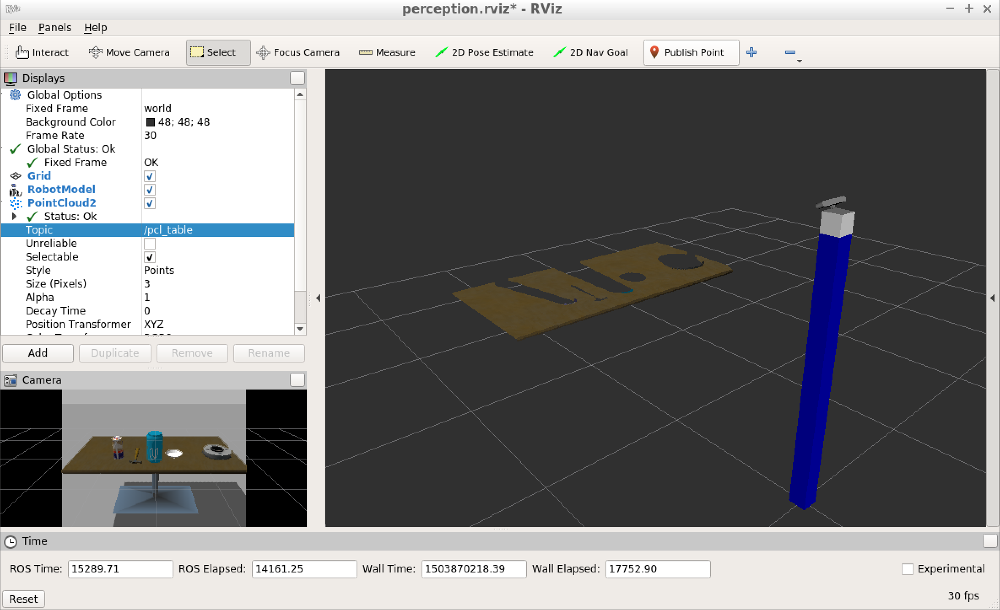
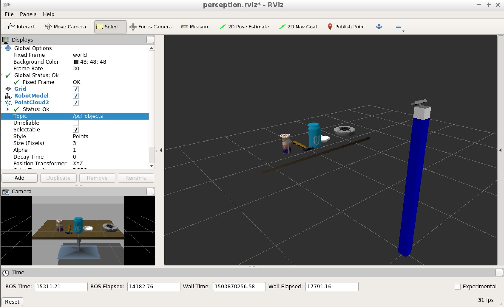
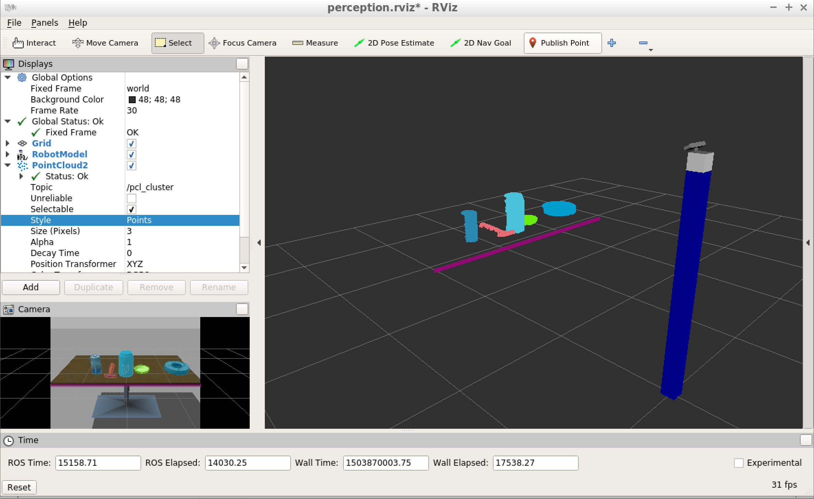

# 3D Segmentation in ROS on RGB-D data

This project performs 3D segmentation on data obtained from a RGB-D camera.

The original project dataset looks like this:

In the first step, RGB-D point cloud is downsampled using Voxel grid filter.

Then a passthrough filter is used to focus only on area above table (table desk included)

[RANSAC](https://en.wikipedia.org/wiki/Random_sample_consensus) is used to perform segmentation around table desktop plane.

The table is extracted as positive segments:

The objects are extracted as negative segments:

In the end, Euclidean clustering utilizing Kd-tree is used to partition object mesh into individual 3D objects and visualized in RViz: 

