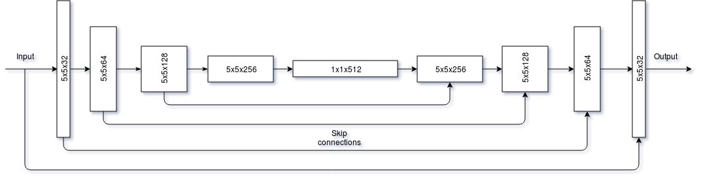
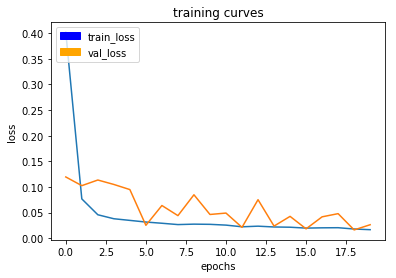
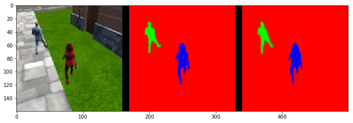
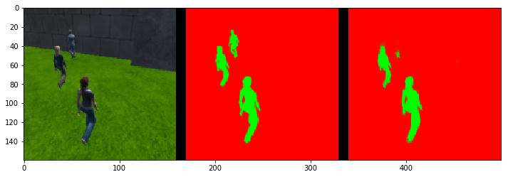
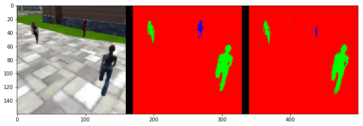
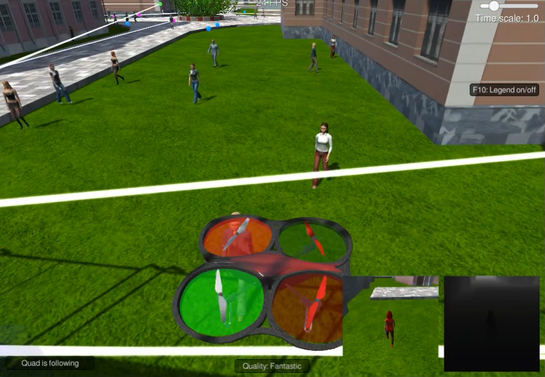

# Follow Me!
## Semantic Segmentation using Fully Convolutional Networks (FCN)

This project enables a drone to find and follow a target person, distinguishing it from other persons.

 

## Architecture

The recognition of a person to follow is done using Fully Convolutional Networks (FCN), configured to function 
as semantic segmentation of images. Semantic segmentation allows finding boundaries of individual objects on the image.

Here is a diagram of the FCN:

The FCN consists of the following parts:

**Encoder**:
Encoder consists of 4 encoder blocks. Each block has the following structure:
- *separable convolution* (kernel size 3x3, number of filters increasing as 32, 64, 128 and 256), with 2x2 strides.
Separable convolutions allow significant reduction of parameters needed to express convolution, making training and 
inference faster, though sacrifice flexibility.
- *batch normalization* for better training performance

**1x1 convolution**:
In the middle of the FCN there is a large 1x1 convolution with 512 filters. It reduces the dimensionality of the encoder
output significantly, similarly to a fully-connected layer, but retains the *spatial information*. 

**Decoder**:
Decoder consists of 4 decoder blocks. Each decoder has the following structure:
- *bilinearly upsampled layer* with factor of 2, enlarging an image
-  *skip connection* to its equivalent encoder block or input to make semantic segmentation more accurate
- 2 sets of *separable convolutional layers with batch normalization* with kernel size 3x3, decreasing number of filers 
of 256, 126, 64 and 32 and 1x1 stride. These reconstruct each step of semantic segmentation until a resulting image is 
formed

**Output**: Output is provided by applying a convolutional layer in the end with 1x1 kernel and as many filters as there are 
segmentation classes, with softmax activation.

## FCN Building Block Roles

The purpose of **encoder** block is to extract features that are useful for semantic segmentation and to significantly 
reduce the dimensionality of the input data. Encoders produce *latent representation* of data in a *latent representation space*
(bottleneck) of much lower dimensionality than the original input data, effectively compressing them. During
training we attempt to construct an encoder that finds an efficient way to compress the data.

The role of **1x1 convolution** is often to to reduce the feature dimensions by collapsing many feature maps into few feature
maps while maintaining the size of each feature map, making computation significantly faster and stable. It can
be also used to increase filter dimensionality. Contrary to fully connected layers which throw away *spatial information*, 
1x1 convolutions retain some spatial information. Fully  connected  layers can be also viewed as convolutions with kernels covering 
their entire input regions. Using 1x1 convolutions then allows outputting heatmaps instead, making them a natural fit 
for semantic segmentation. 

The role of **decoder** is to reconstruct original input, or an output of the same dimension, from the *latent representation*, 
provided by encoder. This process is  lossy and the better encoder/decoder combination is, the better the results are 
(measured by *log-likelihood*). In our case, decoder just needs to output masks with correctly identified persons with 
pixel-level accuracy instead of reproducing the original imagery. Hence we can expect there is a significant non-important
information lost in the encoder-decoder pipeline and only relevant features are kept after the training. 

In the case of *semantic segmentation*, encoder and decoder are connected via **skip connections**, allowing better accuracy
in constructing segmentation map by adding more detail. Here the decoder needs to filter out irrelevant portions of 
encoder output  and keep only those parts improving output accuracy. Encoder-decoder pipeline handles irrelevant data 
as noise and can be viewed as *image denoising* process.

## Training
The following ***hyperparameters*** were used during the training:

    learning_rate = 0.003
    batch_size = 32
    num_epochs = 20
    steps_per_epoch = 100
    validation_steps = 10
    workers = 4
    
These *hyperparameters* were optimized manually by trying different combinations.
 
*Learning rate* was tried between 0.0005 and 0.1, and its effect is to restrict the amplitude of change by a single
weight adjustment. For performance reasons (vectorization), the gradient computation utilizing learning rate is not 
performed for each individual adjustment but for a batch of training examples. Best value was observed at 0.003.

*Batch size*, i.e. number of images used to train network at once, tested were 16, 32, 64 and 128 with 32 giving best 
results. The batch size is a tradeoff between the accuracy of an estimate of gradient (higher is better) and the speed
of training (lower is better). 

*Number of epochs* denotes the number of full forward and backward passes of the whole training set. The lower number
of epochs (<=20) seemed to perform much better than higher number (>40), probably due to tendency of FCN to quickly
overfit and cause accuracy to drop off quickly despite both training and validation losses remaining low.    

*Steps per epoch* is the number of training batches per a single epoch. The value of 100 performed OK, 50 was tried
as well with no observable difference.

*Validation steps* is the number of validation batches at the end of each epoch. I've tested multiple values such as 10,
50 and 100 without any observable effect on validation performance. 10 was chosen in the end.

*Workers* specifies the maximum number of processes used by generator (depends on implementation in Keras).  

Overall, hyperparameter tuning is often art by itself unless one can spawn multiple variations on a cluster of machines
and search for the best performing ones, like in the case of [AutoML](http://www.ml4aad.org/automl/).

The training and validation losses can be observed here:

We can see both have the tendency to lower in time with validation loss damped oscillations above training loss.

## Prediction

Prediction was tested in 3 different scenarios:

*Nearby target:*

*No target:*

*Far target:*

**Final score:** 0.406441601978

## Challenges

The following issues were observed while solving this projects:
- model seems to overfit very quickly; a low number of epochs is usually better than longer training
- insufficient amount of training data in the provided dataset; for better results one needs to generate more data
- adding more layers and increasing kernel size has minuscle effect on results

## Different objects and classes

The method described here would work fine for distinguishing objects/animals/humans that have distinct external 
characteristics, such as clothes, unique color/shape/texture combinations etc. It won't work well if multiple objects
with the same visual characteristics are present in the scene, e.g. it can't distinguish single sheep in a herd from
another one or three cars of the same type/color. The best use case for this method is to distinguish types of objects 
from each other. In our example, if the person followed changed clothes, method wouldn't work anymore, making it 
impractical for real drones.

## Future Enhancements

The current model has a 4-stage FCN architecture; it might be better to reduce the size of the model further to allow
a mobile version with acceptable performance.

Alternative architectures such as [Bayesian SegNet](http://mi.eng.cam.ac.uk/projects/segnet/) or 
[CRF](http://www.robots.ox.ac.uk/~szheng/crfasrnndemo) might be considered instead.

## Video
)
