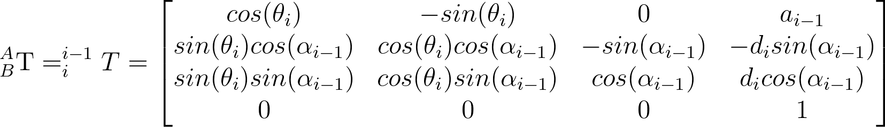

# KUKA KR210 Robotic Arm - Pick & Place

The goal of this project is to calculate forward and inverse kinematics and plan robot movement for picking up objects from a shelf
and moving them into a dropbox.

This project requires ROS Kinetic with RViz, MovIt! and Gazebo 7.7+.

## Kinematics
KUKA KR210 actuations can be seen on the following diagram:

### Denavit-Hartenberg

Denavit-Hartenberg is a useful method of computing forward and inverse kinematics using just 4 parameters, utilizing 
information computed in previous joints and taking advantage of robotic joint composition.

The following Denavit-Hartenberg (DH) table was produced for KR210:

| i | &alpha;_i-1 | a_i-1 | d_i | &theta;_i 
| :-------- | :-------- | :-------- | :-------- | :-------- 
| 0 | 0 | 0| 0.75 | &theta;_1 
| 1 | -&pi;/2 | 0.35 | 0 | &theta;_2 - &pi;/2 
| 2 | 0 | 1.25 | 0 | &theta;_3 
| 3 | -&pi;/2 | -0.054 | 1.5 | &theta;_4 
| 4 | &pi;/2 | 0 | 0 | &theta;_5 
| 5 | -&pi;/2 | 0 | 0 | &theta;_6 
| 6 | 0 | 0 | 0.303 | 0  
    
*where*

***&alpha;_i-1*** is the **twist angle**, the angle between link's *z_i-1* and *z_i* axes measured around *x_i-1* axis.

***a_i-1*** is the **link length**, the distance between link's *z_i-1* and *z_i* axes, measured along *x_i-1* axis.

***d_i*** is the **link offset**, the distance between link's *x_i-1* and *x_i* axes, measured along *z_i* axis.

***&theta;_i*** is the **joint angle**, the angle between link's *x_i-1* and *x_i* axes, measured around *z_i* axis 

    
as seen on the following picture:

    
    
### Joint transform matrices

Each transform has the following structure:

which is a multiplied version of 

where ***R_axis*** is the rotation matrix around axis by specified angle and ***D_axis*** is the translation matrix 
alongside axis by specified length

The position of the end effector (EE) can be computed when we chain all matrices together:

### Inverse kinematics

As we now posses all transformation matrices, we can derive inverse kinematic formulas for all &theta; parameters.

Here the position of **wrist center** (*WC*) is important. Wrist center in KR210 coincides with the joint 5 position, 
as joint 5 is the center of spherical wrist formed from joints 4-6. The position of WC can therefore be obtained from
joints 1-3. We can use T0_EE to compute end effector position and derive WC coordinates:

where (x_EE, y_EE, z_EE) is the position of end effector, derived from T0_EE, l_EE is the length of end effector and
(Z_EE^x, Z_EE^y, Z_EE^z) is the vector along z axis of the gripper link, or the 3rd column of T0_EE. 
 
From these we can now compute first &theta; angles, as described on the following picture:

The final formulas for *&theta;_1-3* are therefore as follows:

To solve &theta;_4-6 we need to use rotational part of T0_EE only. Here we use the following equation:

where &gamma;, &beta;, &alpha; denote roll, pitch and yaw Euler angles.

As the left hand side of equation has no variables after substituting the joint angle values, comparing it with right 
hand side will give us equations for &theta; corresponding to joints 4-5.

## Issues

The solution in this document is energetically very inefficient and trajectories and movements it makes should
be further optimized.

If ran under standalone ROS on a fast machine, gripper might not finish grasping object before the object transfer
motion is started, failing to grip object successfully. To avoid this issue, trajectory_sampler.cpp needs to be patched
at line 327 by adding:

        ros::Duration(2.0).sleep();

## Video

