# 3D Perception-based Pick & Place in ROS with Willow Garage PR2 robot

This project performs 3D object recognition on data obtained from a RGB-D camera and instructs Willow Garage's PR2 robot 
to pick up objects in a given order.

## 3D Perception

In the first step, RGB-D point cloud, obtained from topic "/pr2/world/points", is filtered for noise removal using
statistical outlier filter with 10 neighboring points and 0.3 as threshold scale factor.

Next, the noise-free cloud is downsampled using Voxel grid filter with leaf size of 0.01.

Then a passthrough filter is used to focus only on area above table (table desk included), limiting z coordinates
to 0.6m - 1.1m, y coordinate to -0.4m - 0.4m.

[RANSAC](https://en.wikipedia.org/wiki/Random_sample_consensus) is used to perform segmentation around table desktop plane, \
with maximal distance of 0.01 and planar type.

The table is extracted as positive segments:

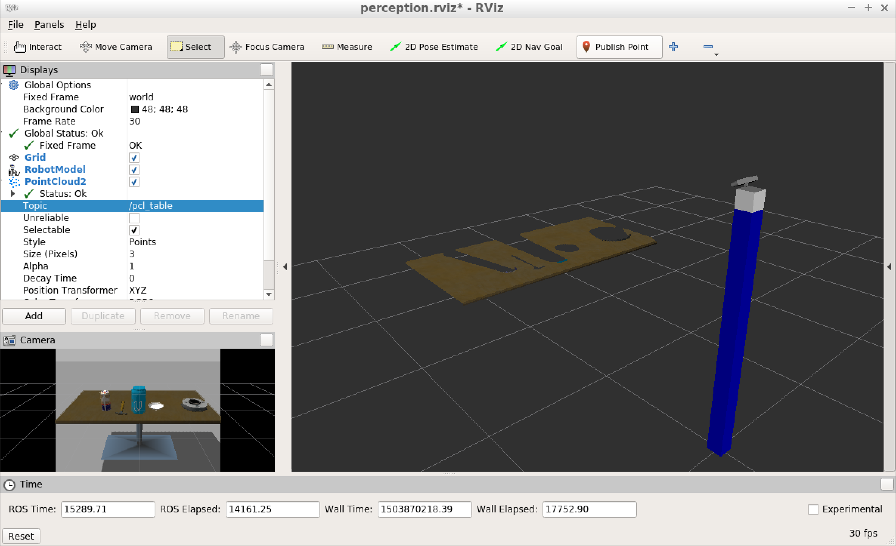

The objects are extracted as negative segments:

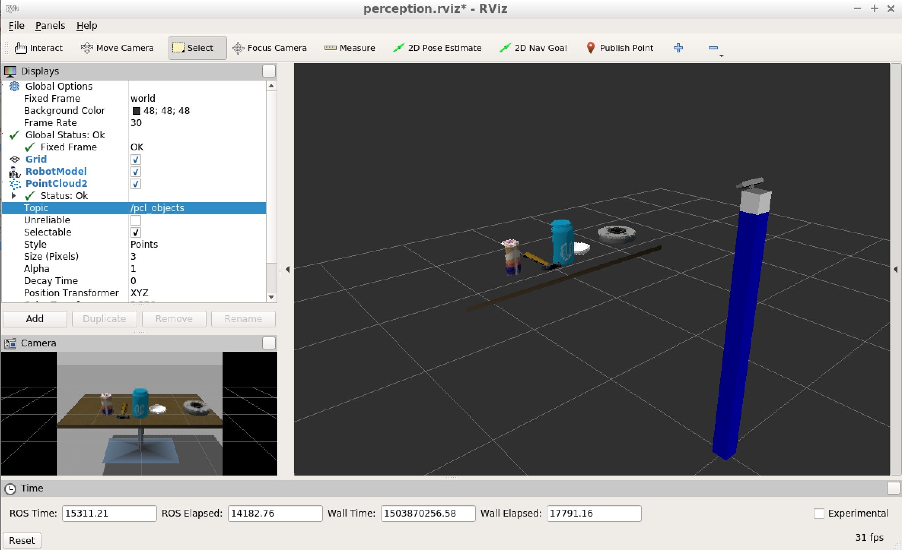

In the end, Euclidean clustering utilizing Kd-tree is used to partition object mesh into individual 3D objects and visualized in RViz: 
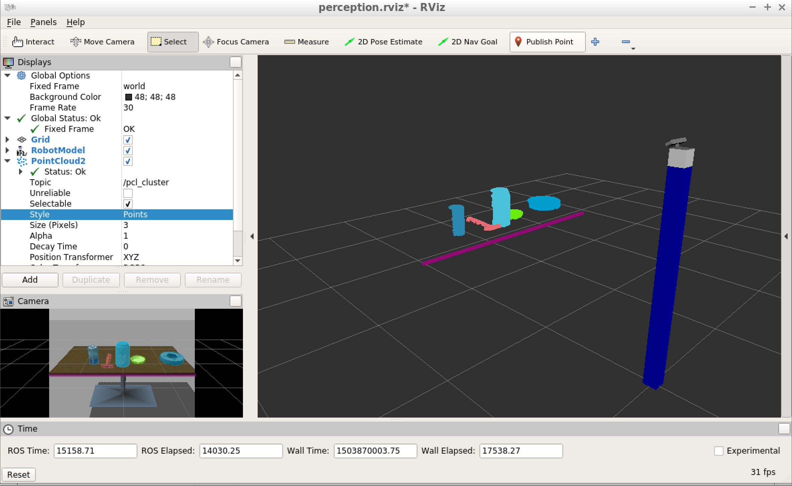

## Feature extraction
First, object features need to be extracted and linear SVM trained to recognize objects.

Features that are used for recognizing 3D objects are the following:
* histogram of HSV channels of pictures of objects
* histogram of normals of surfaces of objects

These two features are combined into a single feature vector and passed to linear SVM for training.

---
Before training, copy [PR2's models](pr2_robot/models) to [sensor stick's models](sensor_stick/models). 
You'd need to repeat this process for each of three worlds; for each pass you need to comment out appropriate 
list of objects to train in [capture_features](sensor_stick/scripts/capture_features.py).
 
To start training, open a terminal in your Catkin workspace and type the following first:

***catkin_make***

***source devel/setup.bash***

***roslaunch sensor_stick training.launch***

Then open a new terminal in the workspace and start the training:

***rosrun sensor_stick capture_features.py***

This produces a feature file ***training_set.sav*** in your Catkin workspace directory. I recommend you to rename this 
file for each world and move it over to [scripts](sensor_stick/scripts). 

Here is what you see in Gazebo:
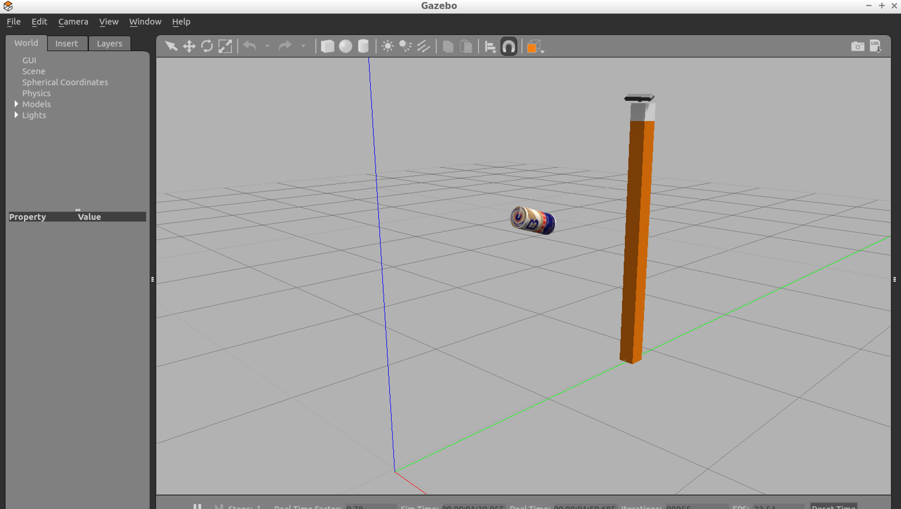

During feature extraction, each object is randomly rotated/placed **1000** times and its feature vectors are captured.
This might take a long time so plan accordingly.

# Training
Next, linear SVM has to be trained from these features.

Assuming you installed ***scikit-learn***, you can start training by typing the following in your workspace:

***rosrun sensor_stick train_svm.py***

With this setup the resulting accuracy is around 98%. To improve accuracy, more training runs as well as different histogram bins should be considered.
Some objects might be difficult to distinguish from each other.

Result of training is stored in the file ***model.sav***. Rename and move this file to [scripts](sensor_stick/scripts) directory.

After training, you should be have a fairly high detection accuracy:
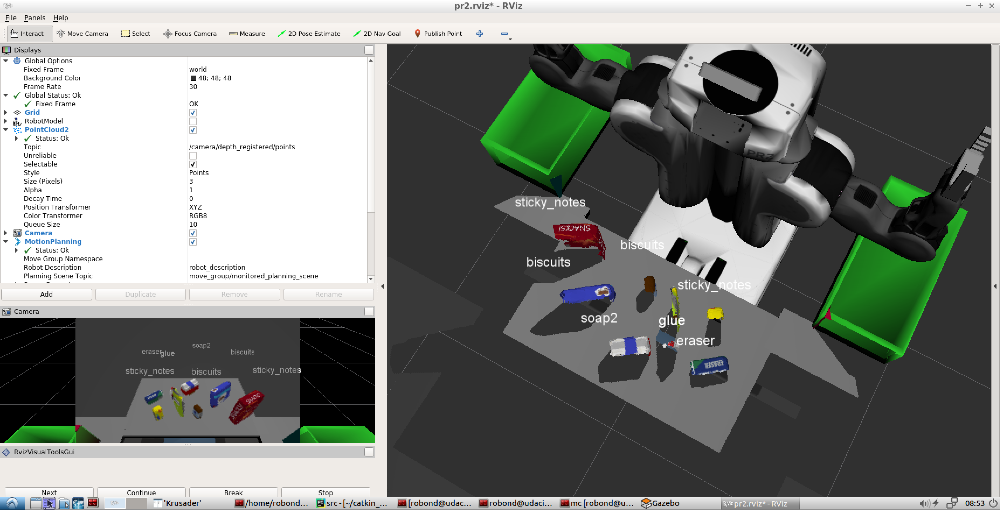

After training, normalized confusion matrices are as follows:

**World 1:**

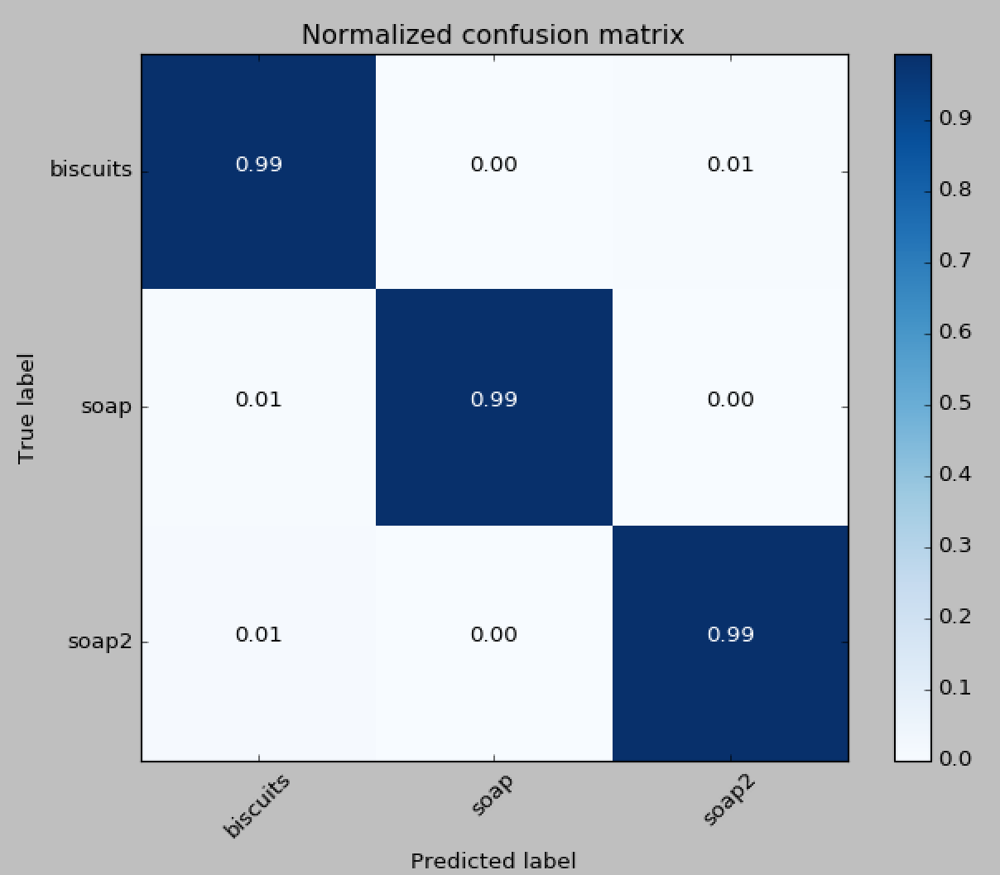

**World 2:**

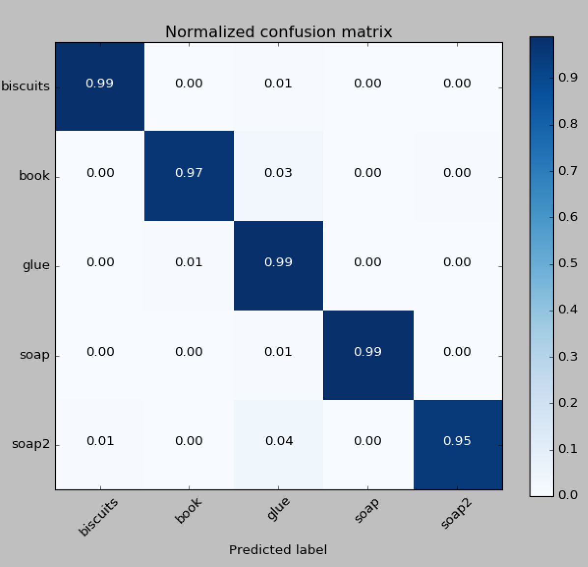

**World 3:**

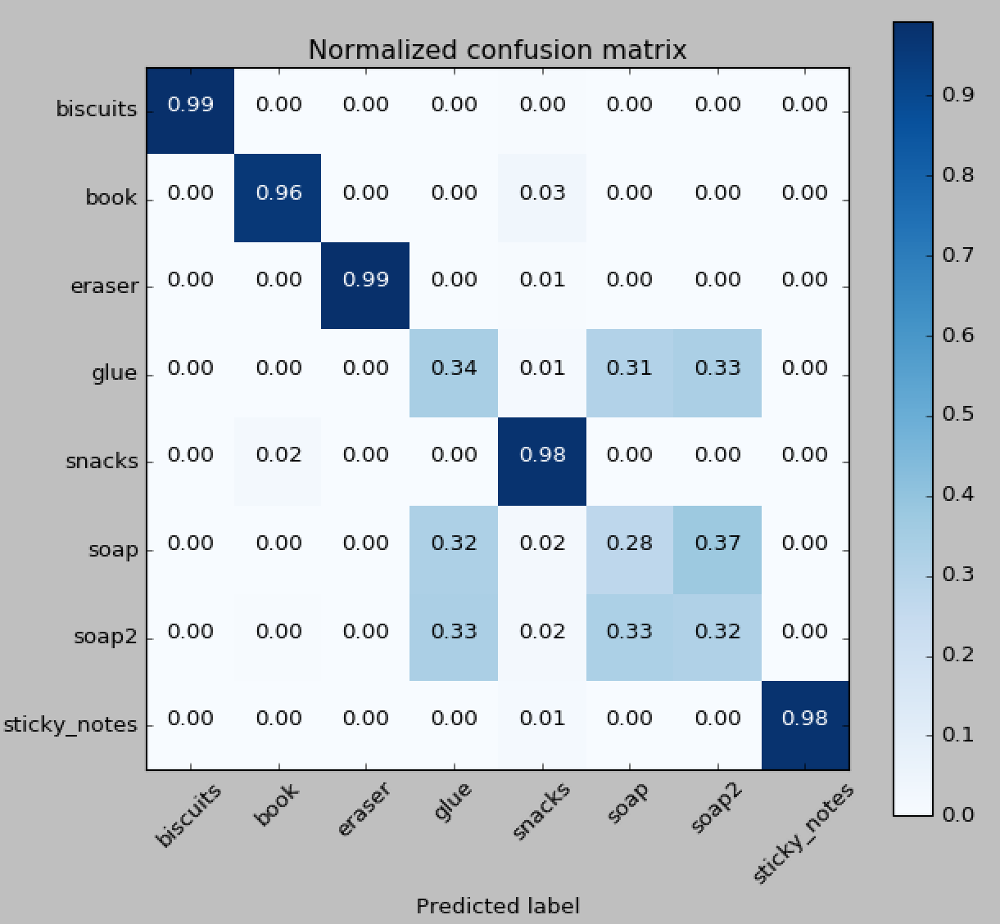

It seems like in the third case Soap, Soap2 and glue were hard to distinguish.

---
## Perception-based Pick and Place

Perception pipeline detects all 3D objects realtime and then passes it to actuating part of the code.

First, for each world do the following:
in [launcher](pr2_robot/launch/pick_place_project.launch) set proper world and pick-up list.
In [source](pr2_robot/scripts/perception_pick_and_place.py) comment out proper world number in all affected elements 
(around lines 270 and 320).
 
The script tries to find required object to be picked amongst the detected objects. If an object is not detected, it is
ignored and next object from the list is processed.

For each detected object its centroid is computed to be the position for pick-up. This is not working well; a better
idea would be to use oriented bounding boxes, computed using PCA and set both centroid and orientation from these.

Next, PR2 is instructed to collect all objects from the list and a resulting YAML ROS messages file is written.

---
To run perception-based pick and place, in your Catkin workspace run the following in first terminal:

***roslaunch pr2_robot pick_place_project.launch***

Then type the following in another terminal in your Catkin workspace:
 
***cd src/pr2_robot/scripts***

***./perception_pick_and_place.py***

In RViz you'll see the following real-time:
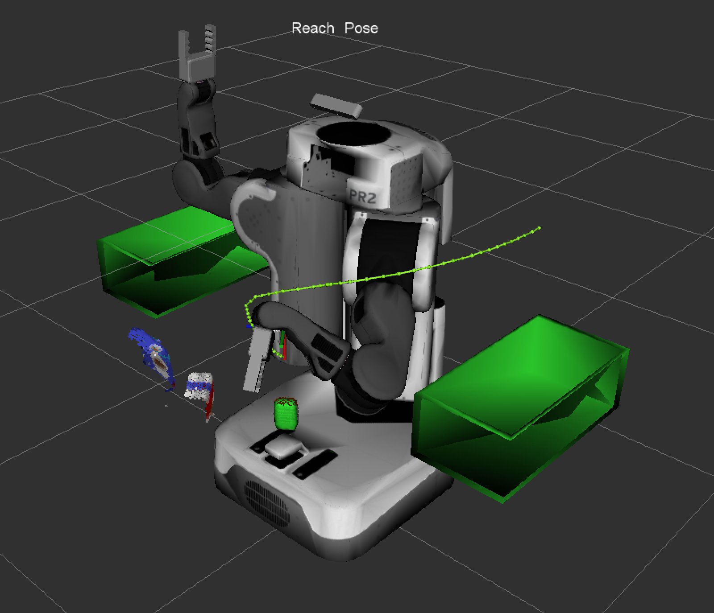

If you press ***Continue*** in RViz, PR2 robot will attempt to collect all items in the order specified in the active pick-up list.

## Results

Pick and place instructions for different worlds are here:

[World 1](output_1.yaml)

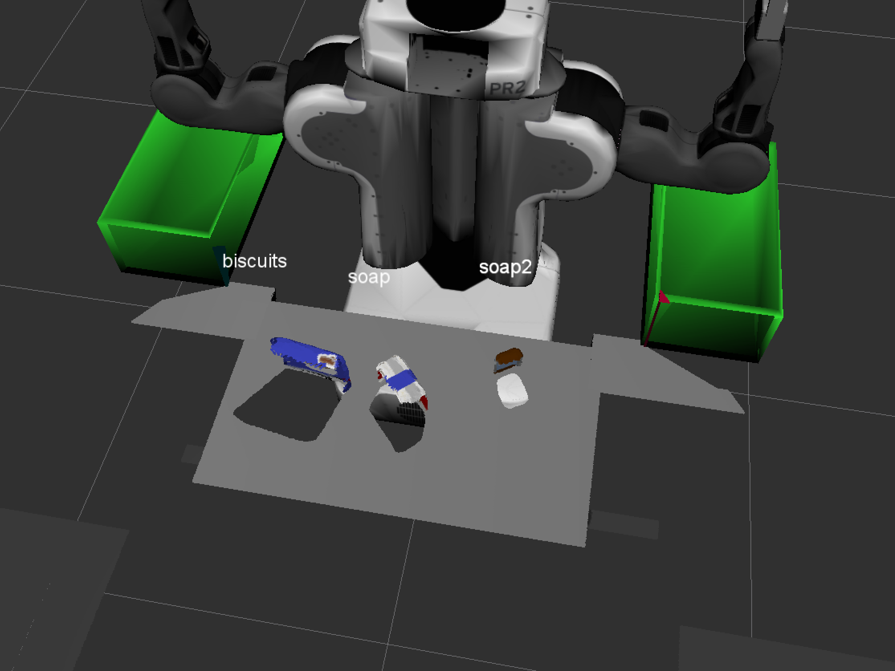

[World 2](output_2.yaml)

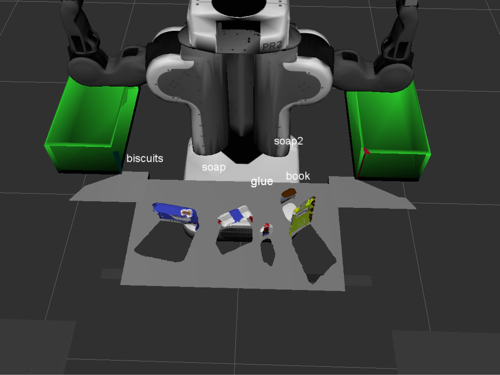

[World 3](output_3.yaml)

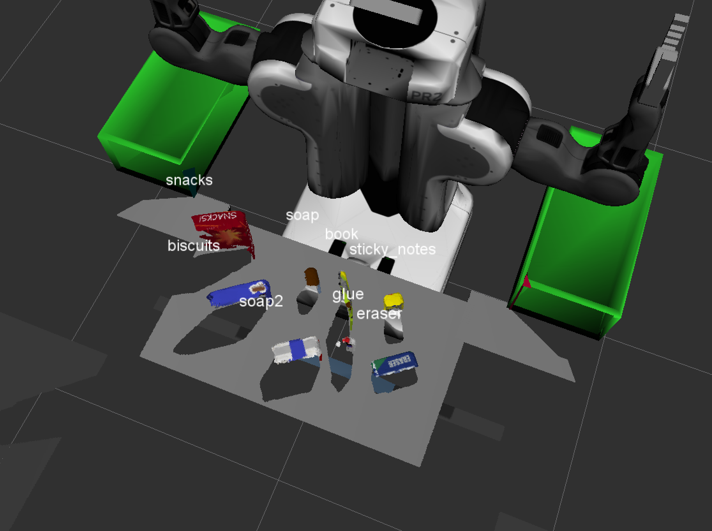

