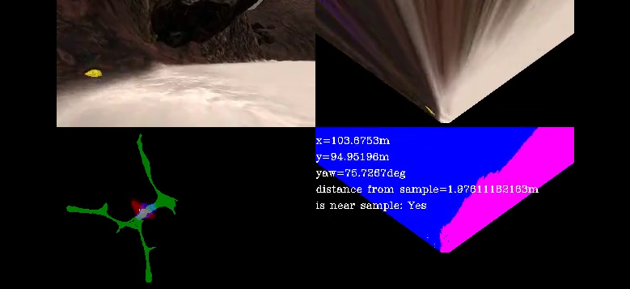

NASA Search and Sample Return
---
[//]: # (Image References)

[image1]: ./misc/rover_image.jpg
[image2]: ./calibration_images/example_grid1.jpg
[image3]: ./calibration_images/example_rock1.jpg 
[vision]: ./misc/rover_vision.png
[notebook]: ./misc/rover_notebook.png
[formulas]: ./misc/sample_formulas.png

![alt text][image1]

### **Autonomous Navigation / Mapping**

#### Notebook Analysis

The Jupyter notebook contains methods for robotic perception. In each step this perception method splits the area into 
drivable part (pink), part with obstacles (blue) and samples (green):

**Notebook implementation:**

*process_image()* was extended to do the following:

- find drivable area & corresponding mask based on RGB threshold corresponding to expected drivable surface
- find obstacle area that is negative of drivable area
- all drivable pixels were converted to rover-centric and then to world coordinates and added to map's channel 2
- all obstacle pixels were converted to rover-centric and then to world coordinates and added to map's channel 0
- all samples that might have been on the screen are found using *mark_rocks()* method
- the sample pixel whose world coordinates are closest to rover is taken and set on map's channel 1
- all three detected channels from the current rover camera image are displayed in the bottom right corner
- additional stats are displayed over the bottom right corner  

A new method *mark_rocks()* was added that searches for all pixels that might be samples.

Method *perspect_transform()* was extended to return binary mask of thresholded pixels as well. 

#### Autonomous Navigation and Mapping

The perception and mapping works as depicted on the following picture:

![vision][vision]

- rover's camera observes the world
- camera image is projected to a "map" view with fidelity decreasing by the distance from rover
- map view image is then thresholded by color corresponding to drivable area
- all possible driving angles are considered and their median is taken as a current direction

#### Autonomous mode  

![alt text][image2] ![alt text][image3]

**The following principles were used for reasonably working autonomous mode:**

- the driving direction selection was based on the median angle from all unhindered angles
- when vehicle goes into looping mode, after a certain number of frames (if it either turns only left or only right)
  it is forced to drive forward for a certain number of frames
- if the vehicle slows down considerably for a certain number of frames, it is assumed it got stuck and
  it is forced to rotate in one random direction for a random number of frames. This should allow vehicle to
  get "unstuck" after a while
- when rover is near a sample to collect, its steering angle is influenced by required angle to reach the sample 
  exponentially; the following formula depicts the computation:
  ![formulas][formulas]
  
  where yaw is the rover's yaw angle, sample_angle is the angle from rover to sample, sample_distance
  is the distance from the rover to the sample and median_angle is the median angle from all possible drivable angles.
  This formula should help reaching samples and overriding dominant median angle selection while not affecting
  steering when distance from nearest sample is large
- to maintain required fidelity, only a narrow range of roll and pitch values are allowed to contribute to mapping
  
**Implementation:**
  
Method *perception_step()* in *perception.py* is composed the following way:

- at **line 107** fidelity of the mapping is ensured by restricting effective roll and pitch angle to a tiny range
- from **line 115** source and destination is defined that is used to prepare a helicopter view of the world around rover
- at **line 122** the camera image is projected to helicopter view and a corresponding binary mask of effective area is obtained as well
- at **lines 125** and **126** drivable area and obstacle (negative) area are estimated using RGB thresholds
- at **line 133** and **134** rover's vision image is updated; the channel 0 with obstacles and channel 2 with drivable area
- at **lines 138** and **139** both drivable areas and obstacles are converted to rover-centric coordinates
- at **lines 145** and **146** are these converted to world coordinates
- from **line 153** if fidelity is high the world map is updated with both obstacles (channel 0) and drivable areas (channel 2)
- at **line 162** the drivable area's rover-centric coordinates are converted to polar coordinates and set to a rover's property
- from **line 166** the samples are first detected with **mark_rock()**, then the nearest rock's coordinate is picked 
and world map (channel 1) updated (if fidelity is high) 
 
Method *decision_step()* in *decision.py* is structured as follows:

- from **line 71** it uses new method *nearest_sample()* to find which detected sample is nearest to rover, disregarding
 locations of already picked samples
- from **line 77** the code handles the situation when rover is considered to be stuck at place. In such case rover 
turns in the prescribed direction (see next description) for prescribed duration. Rover is expected to be in 'stop_slow'
mode and after time expires, it moves to 'forward' mode
- from **line 89** there is a detection if rover indeed is stuck for some time period. In such case the mode changes
 to 'stop_slow', turn direction as well as turn duration is randomly chosen and rover is expected to begin turning in
 order to recover
- from **line 103** the rover is recovering from a cycle; at the end of cycle it moves back to 'forward' mode
- from **line 115** there is a sample nearby; rover tries to apply brake and disengage throttle
- from **line 121** rover stands still near a sample and is initiating a pick up
- from **line 128** rover counts number of consecutive left and right turns in order to detect a cycle
- from **line 138** the code tries to detect if rover ended up in  a cycle; this can happen if there are many consecutive 
turns in exactly one of left or right direction. In such case rover is set to mode 'force_forward' and is expected
to drive forward for certain number of frames
- from **line 150** rover is deciding on the next direction; by default it tries to take average angle of all available
 directions; however if there is insufficient number, rover moves to the 'stop' mode at **line 177**. The interesting
 part here starts from **line 171** where direction to nearest sample influences rover exponentially the closer
 to a sample it is
- from **line 187** rover handles standing still and it first applies brakes to stop from **line 190**, tries
 to turn around from **line 197** if there is insufficient number of available forward directions, or sets the mode
 to 'forward' from **line 205** if there is a sufficient number of available forward directions at the current yaw angle
  
**Issues:**

- sometimes rover gets stuck for a long while until it releases itself
- sample localization is rather inaccurate, causing issues while trying to pick up samples
- path planning is very inaccurate; clothoids with velocity would be much better for that
- rover often drives back to already explored parts of map due to topography and its preference of median angles
- some parts of the map are difficult to navigate due to small gradient between obstacles and road
